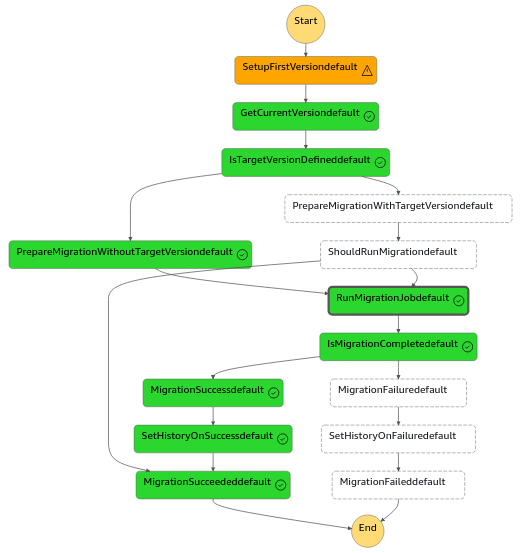
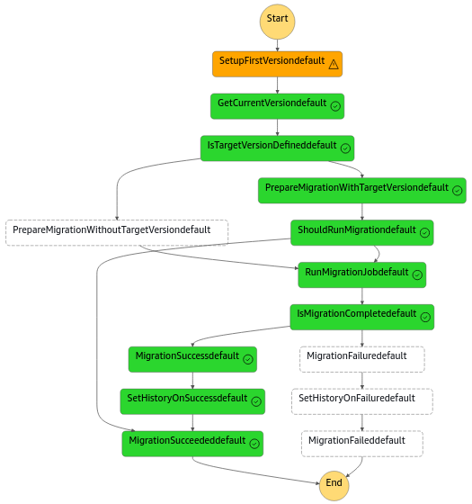

# CDK migration construct and stack

Constructs to manage migration versions performed by a migration lambda

## Usage

It is possible to use either `MigrationConstruct` inside a stack, or use `MigrationStack` as an independent stack
These constructs contain a state machine (Step Functions) and a DynamoDB table to store current state and versions.

They take as input a Lambda function which should perform migrations using a version number strictly increasing.
Lambda input must extend: `{}` or `{ targetVersion: number }`
Lambda output must extend: `{ status: 'SUCCEEDED' | 'FAILED', targetVersion: number }`

### Example with target version defined by the migration runner itself

State machine input: `{}`
The migration runner is responsible for determining the set of migrations to run.



### Example with target version defined in the input

State machine input: `{ targetVersion: number }`
The migration runner is responsible for executing the correct migrations to reach the target version.



## Migration runners

The migration runner is designed to be generic, but only Lambda Functions are available for now.

## Versioning design

Versions must be integers starting from 0 (or `firstVersion` if defined in versioning settings).
Once a set of migrations have been run, the target version is stored in the versioning table in two items:

- Current status item (version is updated only if the migration is successful).

  ```json
  {
    "pk": {
      "S": "_migration"
    },
    "sk": {
      "S": "CURRENT_STATUS"
    },
    // Latest status of the migration status machine
    "status": {
      "S": "SUCCEEDED"
    },
    // Version before the migration was run
    "previousVersion": {
      "N": "7"
    },
    // Version after the migration is successfully run
    "version": {
      "N": "8"
    },
    "metadata": {
      "M": {
        // State entered time (approximately the time when the record is saved)
        "date": {
          "S": "2023-09-01T15:24:12.666Z"
        },
        // State machine start execution time
        "startedAt": {
          "S": "2023-09-01T15:24:12.225Z"
        },
        // State machine that run the migration
        "stateMachineId": {
          "S": "arn:aws:states:[REGION]:[ACCOUNT ID]:stateMachine:[STATE MACHINE ID]"
        }
      }
    }
  }
  ```

- Version item

  ```json
  {
    "pk": {
      "S": "_migration"
    },
    "sk": {
      "S": "VERSION_9#2023-09-01T15:24:12.225Z#c6fe0617-f713-49a6-a52e-89f9e3ca6efa"
    },
    "status": {
      "S": "FAILED"
    },
    "version": {
      "N": "9"
    },
    "metadata": { ... }
  }
  ```

To search for migration data, it is possible to query on the migration partition key (`_migration` by default) and sort on the sort key:

- `"CURRENT_STATUS"` for the current status
- `"VERSION_[VERSION ID]#[DATE ISO FORMAT]#[UUID]"` to for a specific migration run

The versioning table supports a single-table design, that's why only one partition key is used for all migration records.

## Advanced configuration

### Versioning

It is possible to customize the versioning system:

- provide your own DynamoDB table
- change the name of the partition key, sort key
- change the value of the partition key used to store versions
